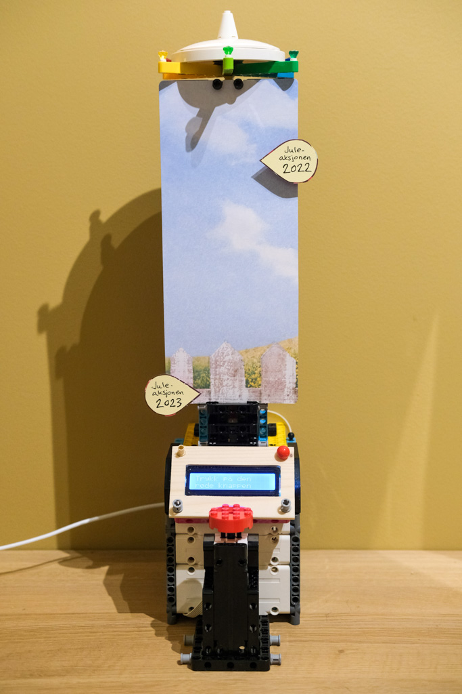
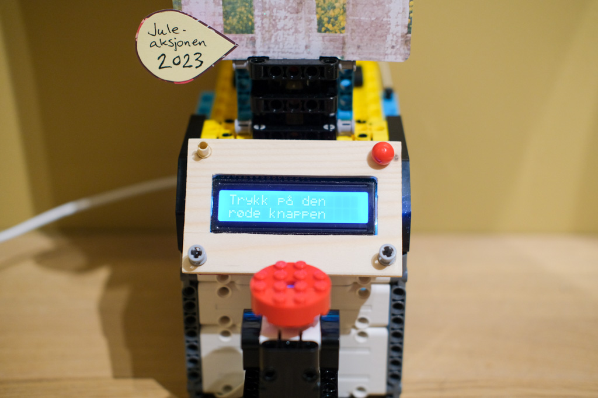
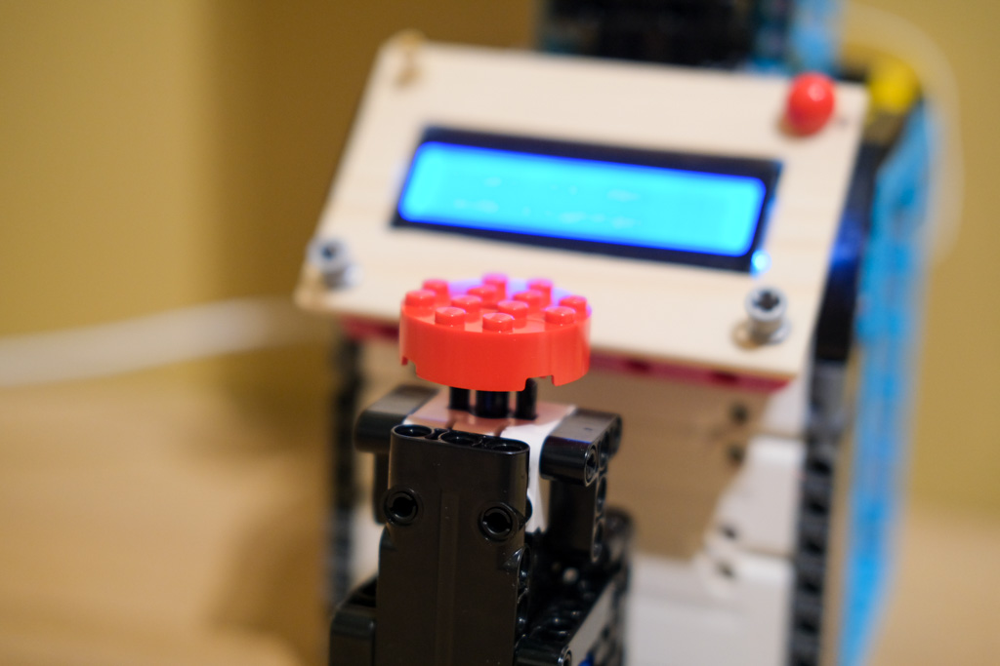
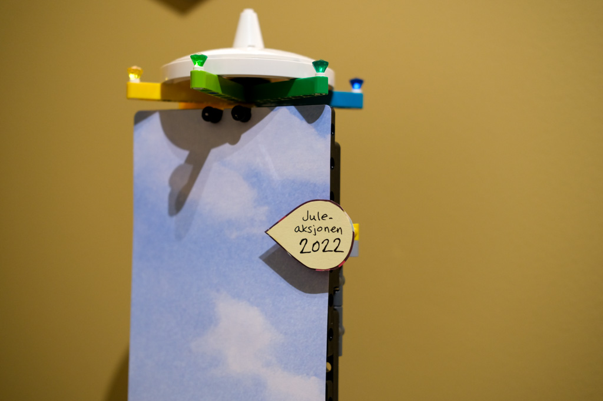
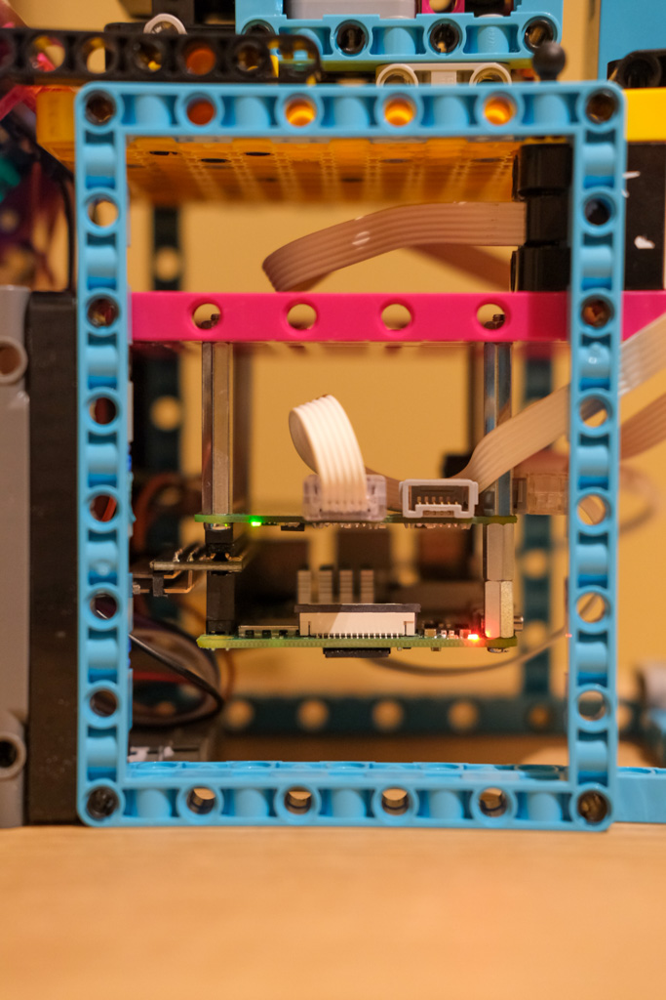

## Readme
This is a project that aims to show live data from Profundo CRM to a Raspeberry Pi, with Lego BuildHAT and LCD display.

We use this to track our progress during our Christmas fundraising campaign. We compare ourselves to last years results.

The goal is to increase internal awareness, and to mobilize our team in a fun and engaging way.

# Images of the project

*The robot*

*User prompt*

*Big old red button*

*The target to beat*

*Raspberry Pi 4 and Lego BuldHAT*