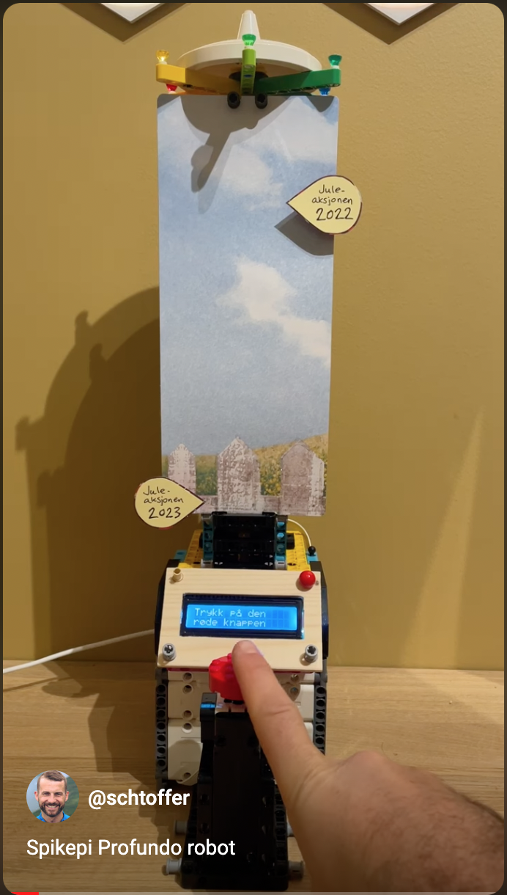

# Readme
This is a project that aims to show live data from Profundo CRM to a Raspeberry Pi, with Lego BuildHAT and LCD display.

We use this to track our progress during our Christmas fundraising campaign. We compare ourselves to last years results.

The goal is to increase internal awareness, and to mobilize our team in a fun and engaging way.

## Demo video

## Images of the project

_The robot_

_User prompt_

_Big old red button_

_The target to beat_

_Raspberry Pi 4 and Lego BuldHAT_

